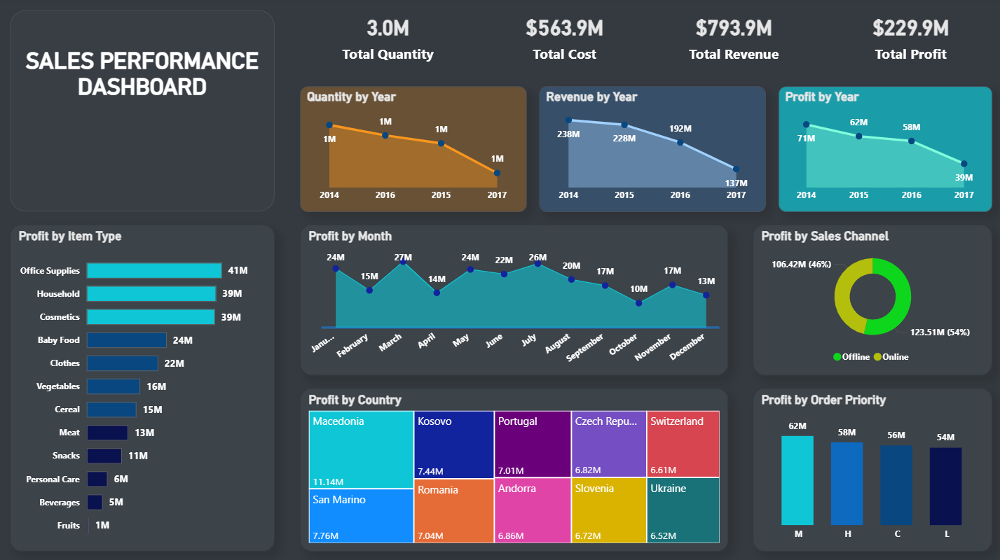

# 🚀 Europe Sales Performance Dashboard – Power BI
## 1. The Challenge & Objective
- This project addresses the critical need to transform a large, disorganized European retail sales dataset into an effective monitoring and decision-making system.
  
- The Challenge: The available data lacked a unified and clear view of annual trends, which complicated the process of identifying positive and negative performance drivers across sales channels and product lines.
  
- The Objective: To design a dynamic, interactive Power BI dashboard capable of analyzing financial performance (Revenue, Cost, Profit) and identifying critical intervention opportunities across diverse European markets over a four-year period.

---

## 2. Methodology & Technical Stack
- Power BI was utilized extensively, showcasing proficiency in key business intelligence disciplines:
- Data Modeling: Establishing robust relationships between Sales, Geography, and Date tables to ensure calculation accuracy and data integrity.
- Advanced DAX: Calculating crucial accounting Key Performance Indicators (KPIs) such as Total Profit, Total Revenue, and Cost, providing a standardized financial perspective.
- Data Transformation (Power Query): Cleaning, shaping, and validating the source data to guarantee high input quality.
- Visual Design: Implementing a professional Dark Theme to enhance readability and draw immediate focus to key performance metrics.

---

## 3. Key Insights & Actionable Findings
This dashboard goes beyond mere reporting, delivering specific, actionable insights:
- 📉 Identified Performance Decline: Visual analysis immediately revealed a severe and continuous decline in sales volume, revenue, and profit, dropping by over 40% from 2014 to 2017. This finding flags an urgent need for re-evaluation of pricing and inventory strategies.
- 🛍️ Profit Concentration: The dashboard demonstrated that Office Supplies and Household are the primary profit drivers, supporting a strategy to focus resources and investment on these core categories.
- 🌍 Geographical Strengths: Macedonia was clearly identified as the top contributor to overall profit, followed by Portugal and San Marino, guiding strategic focus towards high-performing regions.
- 🛒 Channel Dominance: Confirmation that Online Sales generate the vast majority of the profit (over 50%), justifying continued and expanded investment in digital channels.

---

## 4. Dashboard Features at a Glance
- KPI Scorecard: Total Quantity, Cost, Revenue, and Profit.
- Time Series Analysis: Comprehensive display of yearly and monthly performance trends.
- Distribution Analysis: Profit breakdown by Item Type, Sales Channel, and Order Priority.
- Advanced Visualization: Utilizes a Treemap for clear, comparative geographical profit contribution.

---

## 🖼️ Dashboard Preview

